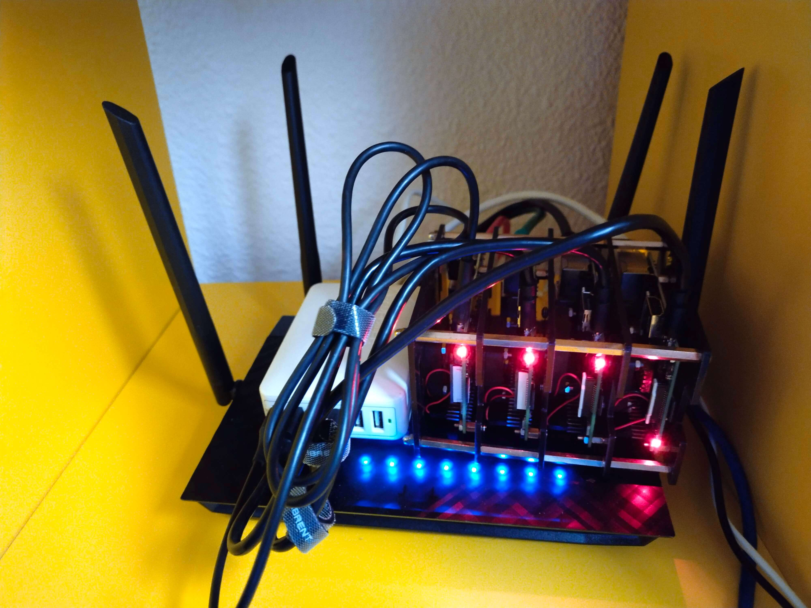
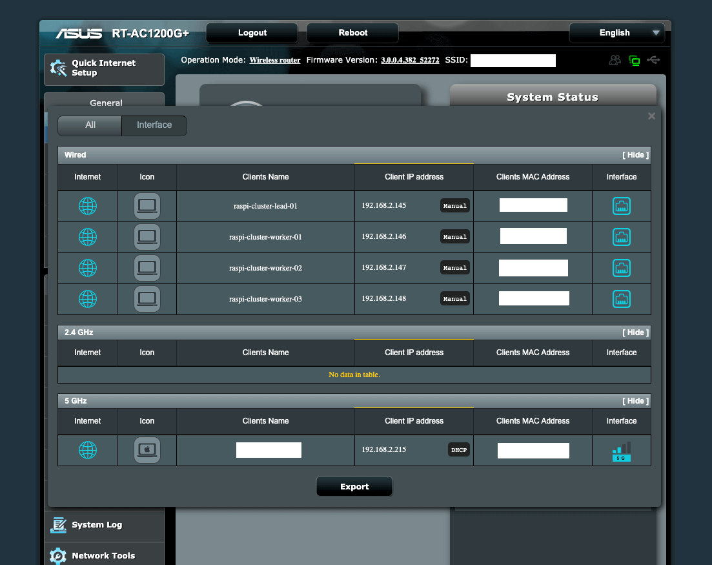
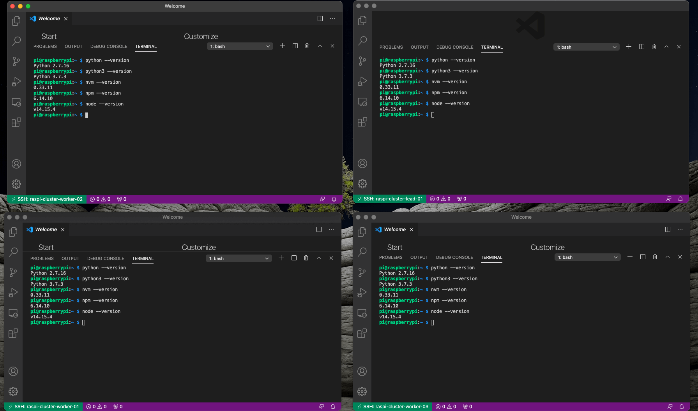

# raspi-cluster
Let's have some fun with a Raspi Cluster



## About the project

### Main objectives
- Build a physical raspi cluster with different raspi versions
- Setup the Network (allowing wifi connection)
- Provision the system using Ansible
- Deploy Kubernetes (K3s) in the cluster

## Hardware

## Provision
### Router
1. Ensure that all the raspis in the cluster have their own fix IP Address.
2. Ensure that the device names are well defined following a pattern like `raspi-cluster-lead-xx` or `raspi-cluster-worker-xx`
3. Make a file with the IP, Signature and name of all the raspis.




### Connection
1. Use VSCode or other tool to connect to the devices using SSH to see that is working fine in the expected IP (defualt user: `pi` and pass: `raspberry`)
2. Copy your host machine public ssh key to each raspberry in other to have a secure connection. [Instructions](https://www.raspberrypi.org/documentation/remote-access/ssh/passwordless.md)
3. Check that the connection works using your key. As well don't forget to remove [the password access option](https://stackoverflow.com/a/20898942) and reboot the ssh service in the raspi `service ssh restart`. Great [script](https://stackoverflow.com/a/29020099) to automate the process


#### Enviromantal Basics

1. Please install [Ansible in your host machine](https://docs.ansible.com/ansible/latest/installation_guide/intro_installation.html). Note: for MacOS i used brew `brew install ansible`

1. We need to install node, nvm, npm, python3 in all the raspis. We will use an Ansible playbook for that `ansible/basics.yml`. Please add your raspis IPs in the `ansible/inventory.ini` file

```bash
ansible-playbook -i inventory.ini basics.yml
```

2. Connect to all raspis using VSCode or another ssh tool and check that all the installations were made correct.

Some commands to run:

```
python --version
python3 --version
npm --version
nvm --version
node --version
```



## Media and more

### Twitter
- [Initial kickoff](https://twitter.com/kom_256/status/1346485230782312450)

## Resources to learn more

- [Playlist: Turing Pi Cluster by Jeff Geerling](https://www.youtube.com/playlist?list=PL2_OBreMn7Frk57NLmLheAaSSpJLLL90G)
- [Run Kubernetes on your Raspberry Pi cluster with k3s by Will Ho](https://ikarus.sg/kubernetes-with-k3s/)